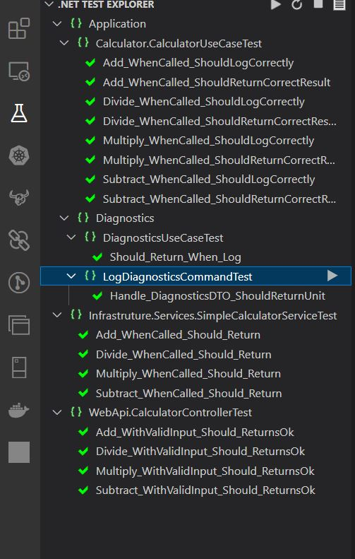
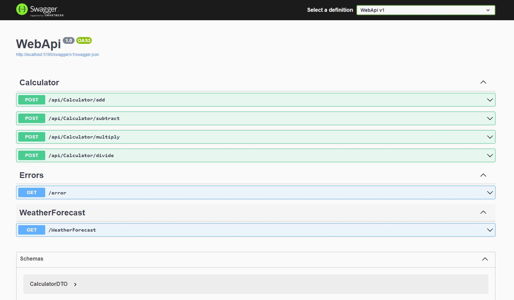
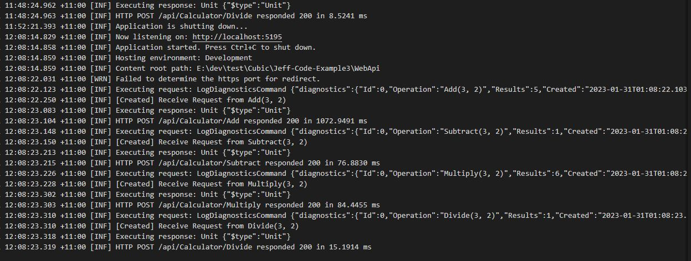

# Jeff Console + WebAPI


## Tech Stack

- [x] .NET 7
- [x] DDD
- [x] Mediator (CQRS)
- [x] Serilog
- [x] Fluent Validation
- [x] EF Core
- [x] ADO.Net
- [x] Swagger
- [x] Health Check
- [x] RestSharp

1. Setup SQL Server

```shell
# Create/Luanch sql server in docker( username: sa, password: Password123!)
docker run -e "ACCEPT_EULA=Y" -e "MSSQL_SA_PASSWORD=Password123!" -p 1433:1433 -d mcr.microsoft.com/mssql/server:2022-latest

# Create TestDB by sql srcipt
./SQL/testdb.sql

# Switch between EF/ADO , set key EFCore: true/false
./appsettings.Development.json

"ConnectionStrings": {
  "TestDBConnection": "Server=localhost;Database=TestDB;User Id=sa;Password=Password123!;TrustServerCertificate=true;",
  "EFCore": true
},

```

2. Build/restore porjects

```shell
# restore package
$ dotnet restore

# solution root folder, command line
$ dotnet build
```

3. Launch web service

```shell
# solution root folder, command line
$ dotnet run --project .\WebApi\
```

4. Launch console apps

```shell
# solution root folder, command line
$ dotnet run --project .\ConsoleClient\
```

5. unit tests



```shell
# solution root folder, command line
$ dotnet test

# Test porject path: ./CodeTest.TestProject
```

6. swagger

http://localhost:5195/swagger



6. logs



```shell
# service logs
# ./WebApi/logs
```
